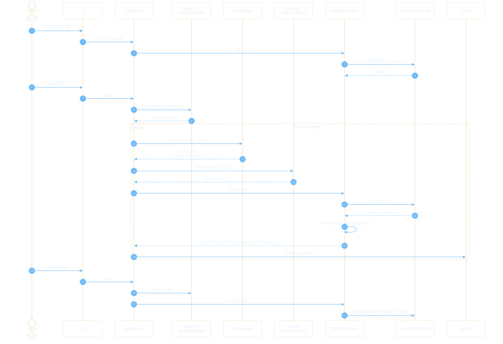

```mermaid
---
config:
  theme: base
  themeVariables:
    actorBkg: "transparent"           # 참여자 박스 배경 색
    actorTextColor: "#e8eaf6"     # 참여자 텍스트 색
    signalColor: "#64b5f6"        # 메시지 선 색
    signalTextColor: "#e3f2fd"    # 메시지 텍스트 색
---
sequenceDiagram
autonumber
actor User as 사용자
participant UI as UI
participant Store as InferStore
participant Audio as Audio I/O<br/>(audioWorklet)
participant Res as Resampler
participant Frm as Framer<br/>(1024 frames)
participant Eng as CREPE Engine
participant Core as Core(TFJS/TVM)
participant Chart as uPlot

User->>UI: 코어/모델 선택
UI->>Store: init(core, model)
Store->>Eng: init()
Eng->>Core: init() + loadModel + warmup()
Core-->>Eng: ready

User->>UI: Start 클릭
UI->>Store: start()
Store->>Audio: getUserMedia(deviceId)
Audio-->>Store: MediaStream

loop Each Sample
  Store->>Res: resample(48k→16k)
  Res-->>Store: audio clip<br/>(Float32Array)
  Store->>Frm: framing(1024 샘플)
  Frm-->>Store: frame(1024)

  Store->>Eng: infer(frame)
  Eng->>Core: run(tensor)
  Core-->>Eng: logits / 360-bins
  Eng->>Eng: decode(soft-argmax/peak)
  Eng-->>Store: {pitchHz, pitchCents, note, conf, latency, t}

  Store->>Chart: setData(update)
end

User->>UI: Pause/Stop
UI->>Store: stop()
Store->>Audio: stop tracks
Store->>Eng: dispose()
Eng->>Core: dispose(model/runtime, tensors)
```